# A graph engine inside Vertica: one billion edges, nine hops, a tenth of a second

*Code: https://github.com/mogomo/vertica-graph-udx (MIT). Earlier work: https://github.com/mogomo/vertica-graphs-and-trees.*

## Abstract

A customer asked a simple question: *"Can Vertica give me level 9 of David's
contacts, the way Neo4j does?"* A year ago the honest answer was "yes, in a few
seconds, with a stored procedure, and for PageRank you still need a graph
engine". This article is about the new answer.

`vgraph` is an open-source C++ extension that puts a graph engine **inside** the
Vertica analytic database. The edges stay in an ordinary table. The engine keeps
a compact index of them inside Vertica, and every query combines that index with
the rows written since, so answers are exact on live data. Results are SQL rows
that join with everything else in the warehouse.

Measured on one virtual machine on a laptop: on **one billion edge rows**,
everyone within nine hops of a person (3.7 million people) is counted in
**0.10 seconds**. All 159.6 million reachable people: **1.1 seconds**. A shortest
path: 33 ms. PageRank over the whole graph: 16 seconds.

Then we put Neo4j on the same machine, loaded the same 100 million rows, asked
the same questions and compared the answers, which were identical every time.
`vgraph` was **38 times faster** on deep neighbourhoods, **11 times faster** on
PageRank, about twice as fast on connected components and mid-size
neighbourhoods, equal on shortest paths and on the smallest questions, and it
used a third of the disk space. It did not start that way: the first run lost on
shortest paths by a factor of 100, and section 4 tells how that was fixed.

For graph analytics, Vertica with this extension surpasses Neo4j's capabilities
in these measurements, and it does so next to the data, in SQL. The same code
passes the same tests on a 3-node Vertica Eon cluster on x86. Everything is on
GitHub, including the script that repeats the comparison on your hardware.

## 1. Graph databases and relational databases

### What a graph is

A graph is a set of things (**nodes**) and connections between them
(**edges**). People and their contacts. Accounts and transfers. Parts and the
assemblies that contain them. Web pages and links.

Most questions about a graph are **traversals**: start at a node, follow edges,
level by level. "Friends of friends" is a two-level traversal. "Could this
payment have reached that account?" is a search for a path.

### How a graph database works

A native graph database such as Neo4j stores each node as a record that points
directly at its edges, and each edge points at its two nodes. Following an edge
is following a pointer. Neo4j calls this *index-free adjacency*. The cost of a
traversal depends on how much of the graph it touches, not on the size of the
whole graph. Queries are written in Cypher, a language made of patterns:

    MATCH (a:Person {id: 1})-[:KNOWS*1..3]-(b) RETURN count(DISTINCT b)

This design is very good at small, local questions. It has a price. The store
is large, because every node and edge is a record with pointers. Whole-graph
algorithms (PageRank, components) do not run on the store: Neo4j's Graph Data
Science library first copies the graph into its own memory format, again after
every restart. And the graph database is one more system. The orders, sessions,
tickets and customer records live elsewhere, so every interesting report
("the revenue of everyone within three hops of a churned customer") crosses a
system boundary.

### How a relational analytic database works

Vertica is a columnar, massively parallel SQL database. Each column is stored
separately, sorted and compressed, and tables are spread over the nodes of a
cluster. It scans, joins and aggregates billions of rows quickly, scales out by
adding nodes, and runs machine learning in the database. An edge table is a
natural fit: two integer columns compress to a few bytes per edge.

In plain SQL a traversal is a self-join per level: join the people found so far
with the edge table, remove the ones already seen, repeat. Vertica does this
well: the earlier repository,
[vertica-graphs-and-trees](https://github.com/mogomo/vertica-graphs-and-trees),
answers nine levels over 100 million rows in 2.5 seconds with a stored
procedure. But every level is a join against the whole edge table, so the cost
grows with the table and with the depth.

One trap is worth knowing. The SQL standard's `WITH RECURSIVE` looks like the
right tool. Vertica unrolls it into a fixed number of levels, the parameter
`WithClauseRecursionLimit`, 8 by default, and **drops deeper levels without an
error or a warning**. It also follows every path instead of every node, which
explodes on a graph with cycles. The honest SQL baseline is therefore a
procedure that runs one `INSERT ... SELECT` per level.

### Bringing the two together

The idea behind `vgraph` is simple: keep the data and the language of the
analytic database, and give it the one thing graph databases have that SQL
lacks, a structure in which a node's neighbours are found by position instead
of by join.

Vertica can be extended with functions written in C++ (a UDx, user-defined
extension), loaded as a library and called from SQL. `vgraph` is such a
library. C++ matters here: the traversal is a tight loop over arrays, the kind
of code where a compiled language with control over memory layout is several
times faster than the Java virtual machine or Python.

| | Native graph database (Neo4j) | Vertica with vgraph |
|---|---|---|
| Where the edges live | its own store, a copy of your data | an ordinary table you already have |
| Freshness | as fresh as the last import or sync | exact: the index plus the rows written since |
| Language | Cypher | SQL; the result is rows you can join, filter, aggregate |
| Small, local questions | 1 to 3 ms | 2 to 4 ms (the cost of a SQL statement) |
| Deep traversals, whole-graph algorithms | seconds | 10 to 40 times faster in the tests below |
| Whole-graph algorithms | after a projection into memory | directly on the index |
| Disk for 100 million edge rows | 3.2 GB | 1.1 GB (table and index) |
| Business data, reporting, machine learning | another system | the same database |
| Scale out, backup, security, high availability | its own | Vertica's: the index is a table |

## 2. What a graph database does, and how vgraph does it

### The index: a snapshot in compressed sparse row form

`vgraph` builds the classic compact form of a graph, CSR: one array holding
all neighbour lists back to back, one array that says where each node's list
starts, and a sorted array of node ids. Nodes are numbered by position, so a
neighbour is a 4-byte number, and one hop is one array lookup. This is
index-free adjacency without the pointers and records: 667 MB for 100 million
edge rows.

1. **Build.** `refresh_graph` reads the edge table once and writes the snapshot
   into a normal Vertica table, in 8 MB pieces. It is backed up, replicated and
   secured like any other table, also on Eon and Kubernetes.
2. **Load.** Every node of the cluster writes the snapshot into a local cache
   file. A lost cache is never a data loss: it is rebuilt from the table.
3. **Query.** The functions map that file into memory, read-only. All
   concurrent queries share one copy in the operating system's page cache, and
   the file may be larger than free memory.

### The functions

| A graph database offers | vgraph function | How it works |
|---|---|---|
| Neighbourhood, "within k hops" | `gkhop`, `gkhop_count` | breadth-first search over the CSR on all cores; one bit per node marks the visited ones; large levels switch direction (see below); `gkhop_count` returns one row per distance instead of millions of rows |
| Shortest path | `gpath` | two searches, from both ends, that meet in the middle; visited nodes in a small hash table; Dijkstra when `weighted=true` |
| Connected components, "islands" | `gcomponents`, `gcomponents_count` | union-find on several threads, lock-free (compare and swap) |
| Centrality | `gpagerank` | power iteration on several threads; every node gathers the shares of its in-neighbours, so threads never write the same memory; `top=N` returns the N highest |
| Direction, depth limits, several start nodes | parameters `direction`, `depth`, `exact`, `max_results`; one request row per start node | |

A query is one SQL statement:

    SELECT vgraph.gkhop(start, target, src, dst, del, weight, ver, snapshot_id
                        USING PARAMETERS graph='contacts', start=12345, depth=3) OVER()
    FROM app.contacts_delta;

The result is a set of rows. Joining it with the customer table, filtering it by
region or feeding it to a machine learning function is one more SQL clause.

**Using all cores, and searching backwards.** A small search runs on one thread
and starts none. A search that grows large is spread over the cores of the
server, level by level. And when the frontier becomes a large part of what is
left, the search turns around: instead of the frontier looking for unvisited
neighbours, every unvisited node looks for one neighbour in the frontier and
stops at the first hit. This direction-optimizing search (Beamer, Asanovic and
Patterson, 2012) is why reaching all 159.6 million people of the billion-edge
graph takes 1.1 seconds instead of 15.

Results do not depend on the number of threads: the same input gives the same
output, bit for bit. The tests enforce it.

### An index that is never stale

A snapshot is a copy, and copies go stale. `vgraph` solves this inside the
database.

The edge table is used as a **journal**. Adding an edge is an `INSERT`.
Deleting an edge is an `INSERT` of the same edge with a delete flag. A version
column, `ts TIMESTAMPTZ DEFAULT CLOCK_TIMESTAMP()`, records when each row was
written. The latest row per edge wins.

Every query reads the snapshot **and** the journal rows written after it,
applies them on top (adds, deletes, new nodes) and then runs the search.
Results are exact between rebuilds, not only after them. A scheduled
`refresh_graph` keeps the pending changes small.

Two details make this safe and fast:

- **No row is lost at the boundary.** A row could be missed if its transaction
  was still open when the build started reading. An open writer holds an insert
  lock on the table. The refresh reads Vertica's lock table and starts the
  pending changes at the earliest lock request of an open writer. No guess about
  transaction length is needed.
- **Reading the pending changes is cheap.** The journal is partitioned by the
  date of the version column, and the view that reads the changes carries the
  boundary as a literal, so Vertica prunes partitions: 1 ms on a 100 million row
  table, where the same read took up to 5 seconds without that layout.

### Building the index for a billion edges

Holding a billion edges in a function would take about 24 GB. For large graphs
`vgraph` lets Vertica do what it is good at: the node map and the sorted edges
are built in tables, which spill to disk under Vertica's own memory management,
and the function writes the snapshot section by section through one 8 MB
buffer. Both build paths write the same file, byte for byte; the tests enforce
that too.

### Tables that store both directions

Many contact tables store a contact between a and b twice, as the rows (a, b)
and (b, a). This is convenient in SQL: "the contacts of a" is one lookup.

For such a table the list of nodes pointing *to* a node equals the list of nodes
it points to. `vgraph` then stores no reverse index, and the snapshot is about
half the size (667 MB instead of 1.2 GB at 100 million rows). The build detects
this by itself. For the streaming build, the proof is a join of all edges with
themselves, which takes minutes at a billion rows. If you know your table, you
declare it:

    UPDATE vgraph.manifest SET both_directions = TRUE WHERE graph = 'contacts';
    -- or: scripts/register.sh ... --both_directions

The join is skipped. A cheap test (one scan, order-independent hash sums) still
runs at every refresh; a wrong declaration fails with a clear message and the
previous snapshot stays active. At one billion rows this cut the whole refresh
from **17.9 to 10.8 minutes**.

This is a different thing from `directed = false`, which is for tables that
store each contact once: there the build adds the reverse edges itself.

## 3. From SQL demos to an engine: the two repositories

| | [vertica-graphs-and-trees](https://github.com/mogomo/vertica-graphs-and-trees) | [vertica-graph-udx](https://github.com/mogomo/vertica-graph-udx) |
|---|---|---|
| What it is | three SQL demos: graph traversal, closure-table trees, a Cypher-to-SQL translator | a C++ library of graph functions, with procedures, tests and benchmarks |
| Traversal | stored procedure, one `INSERT ... SELECT` per level | breadth-first search over a CSR snapshot |
| Cost of a deep question | grows with the table: 2.5 s at 100M rows, 16.8 s at 1B | grows with the answer: 0.09 s at 100M, 0.10 s at 1B |
| Shortest path, components, PageRank | not attempted | `gpath`, `gcomponents`, `gpagerank` |
| Changing data | re-run | exact on live data, through the journal |
| Trees, hierarchies | closure table: every question is a lookup of 1 to 24 ms | use the closure table; it is the right design for trees |
| Role today | the data generator and the correctness reference | the engine |

The first repository ended with an honest sentence: for arbitrary paths and for
algorithms such as PageRank, "a graph engine remains the right tool". The second
repository is that graph engine, inside Vertica. Every `gkhop` result in the
tests and benchmarks is compared with the first repository's SQL procedure: same
people, same distances, in every run.

## 4. Measurements

Data: the contact generator of the first repository. Every person knows a few
random people; each contact is stored in both directions. All times are server
times from Vertica's system table `v_monitor.query_requests`, measured on the
database server, results counted inside the database. No client or network time
is included.

### Environments

| | A: single node | B: 3-node Eon cluster |
|---|---|---|
| Hardware | a virtual machine on a Mac laptop, ARM (aarch64), 8 cores, 15 GB RAM (35 GB for the 1B test) | x86_64, 2 cores and 15 GB per node, a small machine that was swapping during the test |
| Software | Rocky Linux 9, g++ 11.5, Vertica 26.2 | RHEL 8.10, g++ 8.5, Vertica 26.2, Eon mode |
| Role | the performance numbers | functional proof: a different processor architecture, compiler and storage mode, several nodes |

Every change is tested on both: 7 unit test programs (with address, undefined
behaviour and thread sanitizers) and 4 integration suites with 52 checks, fenced
and unfenced. A randomised test compares the multi-threaded search with the
single-threaded one, node by node.

### 100 million edge rows, both environments (first release, fenced)

| Step | A | B |
|---|---:|---:|
| build the snapshot | 19.1 s | 80.9 s |
| load it on all nodes | 1.8 s | 5.1 s (three nodes) |
| count everyone within 9 hops | 0.25 s | 0.48 s |
| return everyone within 9 hops (5.8 / 4.0 million rows) | 0.95 s | 1.63 s |
| 2 hops (about 50 people) | 5 ms | 22 ms |
| SQL procedure, 9 hops | 2.51 s | 4.87 s |

Environment B is a quarter of the cores and was short of memory, and it still
answers nine hops in half a second. What it proves is portability: the snapshot
format, the load on every node of a cluster (`gload` reaches all three nodes),
the freshness rules and the stale-cache safety check behave the same on Eon and
on x86.

### The same machine, the same data: vgraph and Neo4j

Environment A, 35 GB RAM. 100 million contact rows, 16.7 million people.
Neo4j 5.26 Community with APOC and Graph Data Science 2.13, 8 GB heap and 8 GB
page cache, loaded with `neo4j-admin database import`. Neo4j stores every
contact once and is asked without a direction, its natural model. Best of three
runs on both sides. **Both systems returned the same result for every
question**; the script `scripts/neo4j_compare.sh` checks that, and repeats the
whole test on your hardware.

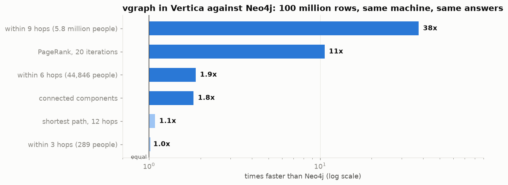

| 100 million rows | vgraph | Neo4j | |
|---|---:|---:|---|
| people within 2 hops (55) | 3 ms | 1 to 3 ms | equal (see the note below) |
| people within 3 hops (289) | 2 ms | 1 to 3 ms | equal |
| people within 6 hops (44,846) | **8 ms** | 15 ms (Cypher), 20 ms (APOC) | **2 times faster** |
| people within 9 hops (5.8 million) | **0.086 s** | 3.2 s (Cypher), 5.1 s (APOC) | **38 to 59 times faster** |
| shortest path, 12 hops | 12 ms | 13 ms | equal |
| connected components | **0.34 s** | 0.63 s, after a 5.6 s projection | **1.8 times faster**, 18 times with the projection |
| PageRank, 20 iterations | **1.55 s** | 16.5 s, after the same projection | **11 times faster** |
| load the data | 16 s | 9 s export, 24 s import, 2 s index | |
| prepare for graph queries | 22 s, once per refresh | 5.6 s, after every restart | |
| size on disk | **1.1 GB** (table 444 MB, snapshot 667 MB) | 3.2 GB | **a third** |

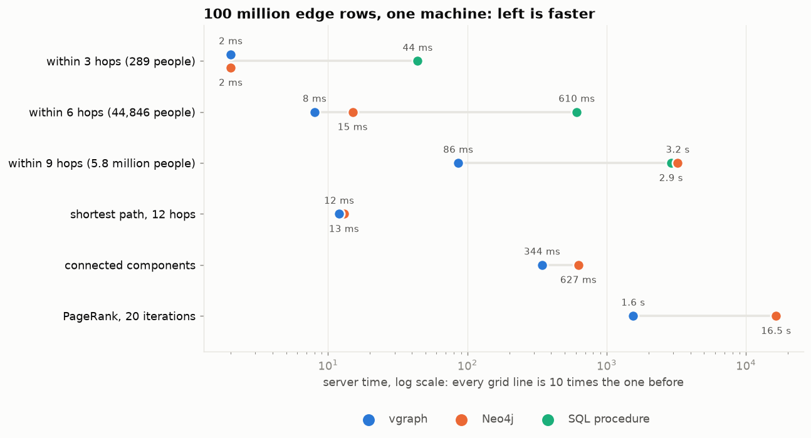

vgraph runs unfenced here (inside the Vertica process) and uses all 8 cores;
the Graph Data Science community edition is limited to 4 threads. Fenced, in a
separate process, a call costs 2 to 3 ms more and large results about 20% more;
every test passes in both modes.

**A note on the millisecond rows.** On this machine the statement `SELECT 1;`
takes up to 2 ms in Vertica. It does nothing, and that is the point: parsing,
planning and starting a plan cost that much before any work begins. Any result
at or below that level measures the cost of a statement, not of a graph search,
and a difference of one or two milliseconds between the systems there is not an
apples-to-apples difference in graph performance. Those rows can safely be
ignored when comparing the engines. They are in the table for one reason only:
we publish every number we measured, not just the ones we like.

**How we got here, honestly.** The first comparison run was not flattering
everywhere. Neo4j found the 12-hop shortest path in 14 ms; `vgraph` needed
1.56 seconds, because it searched from one end and visited most of the graph.
Neo4j also won connected components. Three changes later, a search from both
ends that meets in the middle, a hash table instead of graph-sized arrays for
small searches, and lock-free multi-threaded algorithms, the path takes 12 ms
and components 0.34 s. One optimisation made things *worse* and was thrown out:
memory that the operating system zeroes on demand looked clever and lost to a
plain bitmap, because page faults cost more than the writes they saved. And
compiling for the exact processor (`-O3 -mcpu=native`) changed nothing at all:
this work is random memory access, not arithmetic, so the portable build is the
fast build. A competitor on the same machine is the best profiler there is.

The honest limits of this comparison: one data shape (a random contact graph,
three contacts per person), one machine, Neo4j Community with default settings
apart from memory. Your graph will differ. The script is there so you can measure
it instead of believing either of us.

### One billion edge rows

Environment A with 35 GB RAM: one node, 8 cores, a laptop. 166.7 million people,
999,999,977 distinct edges, a 6.67 GB snapshot. Vertica's memory settings were
not touched, and the machine did not swap.

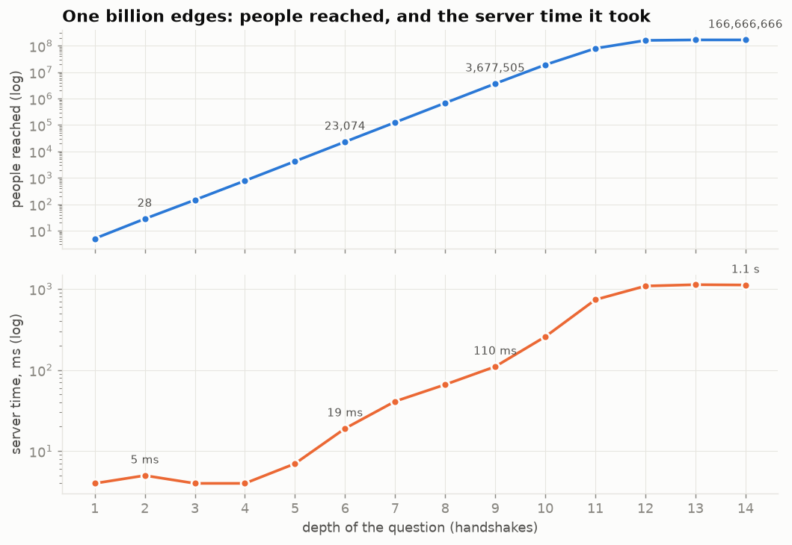

| Step, 1 billion rows | Time |
|---|---:|
| load the 1 billion rows into Vertica | 116 s |
| build and load the snapshot (`refresh_graph`, streaming, both directions declared) | 10.8 min |
| people within 2 hops (41) | 3 ms |
| people within 9 hops (3.7 million), counted | **0.10 s** |
| the same, all 3.7 million rows returned | 1.0 s |
| everyone reachable: 159.6 million people | **1.1 s** (15.4 s on one thread, before the parallel search) |
| shortest path, 11 hops | 33 ms |
| connected components of the whole graph | 4.3 s |
| PageRank, 20 iterations, whole graph | 15.8 s |
| SQL procedure, 9 hops, same result | 16.8 s |

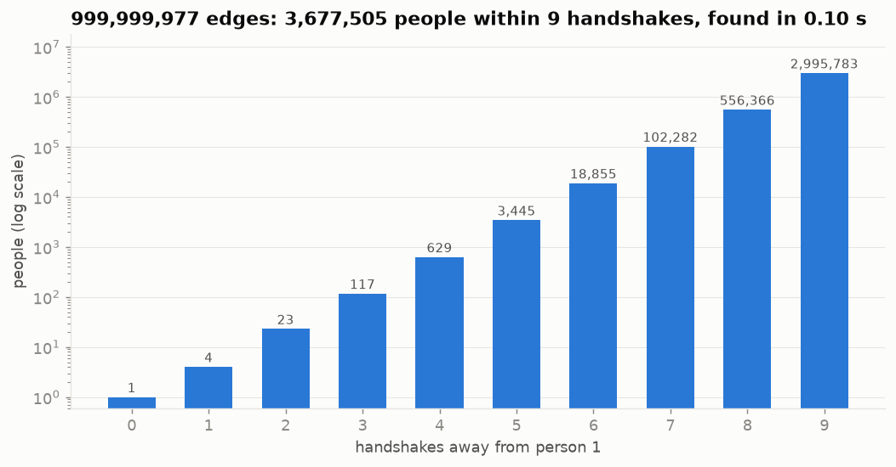

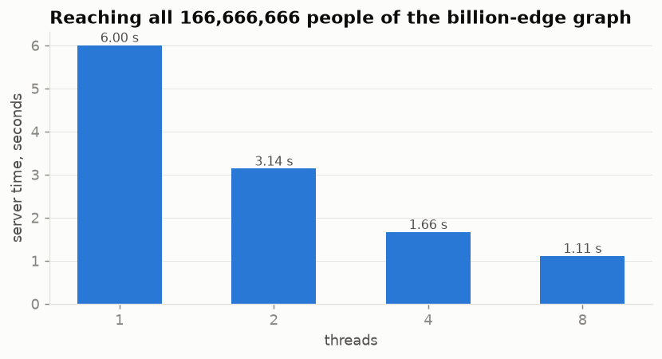

Three observations.

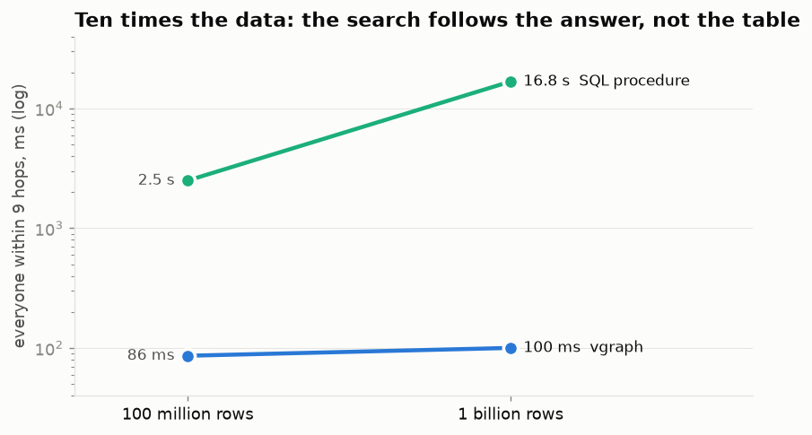

**Query time follows the answer, not the table.** Nine hops cost 0.09 s at
100 million rows and 0.10 s at one billion. The search touches the people it
reaches and nothing else. The SQL procedure joins against the whole edge table
at every level, so it grew from 2.5 s to 16.8 s.

**Returning rows costs more than finding them.** Counting 3.7 million people
takes 0.10 s; returning them as rows takes 1.0 s. If you need numbers, ask for
counts (`gkhop_count`, `gcomponents_count`, `top=N`). If you need the people,
keep them in a temporary table and join there.

**The build does not need the memory.** The streaming build holds 8 MB while
Vertica sorts a billion rows under its own resource management.

## 5. A use case you can run: following the money

The repository contains a Jupyter notebook,
[notebook/vgraph_demo.ipynb](https://github.com/mogomo/vertica-graph-udx/blob/main/notebook/vgraph_demo.ipynb),
that uses VerticaPy and plays an investigation on a payments network of 50,000
accounts. One account is flagged. Every answer is one SQL statement.

**Where did the money go?** `gkhop` with `direction='out'` follows the transfers
forward, five deep, and the join to the accounts table adds names and cities.
16 ms.

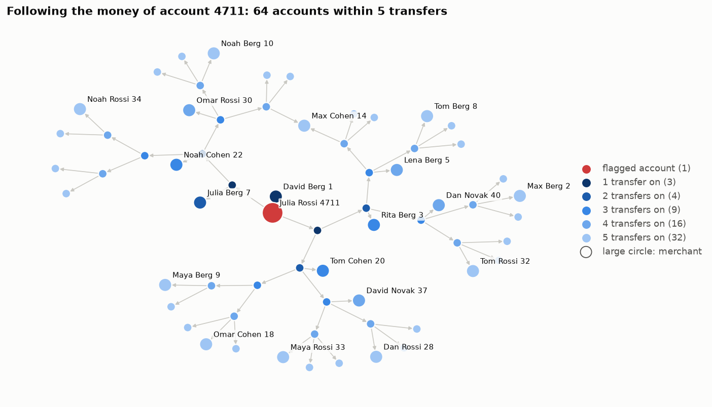

**How is the flagged account connected to this customer?** `gpath`, 15 ms.

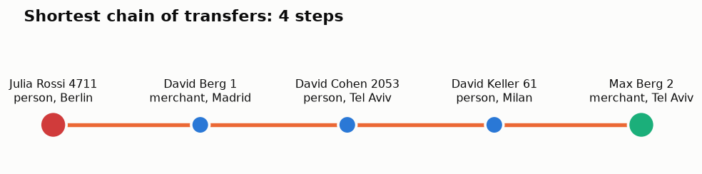

**Which accounts only deal with each other?** `gcomponents_count` finds the giant
component and three small closed circles that were planted in the data. 5 ms.

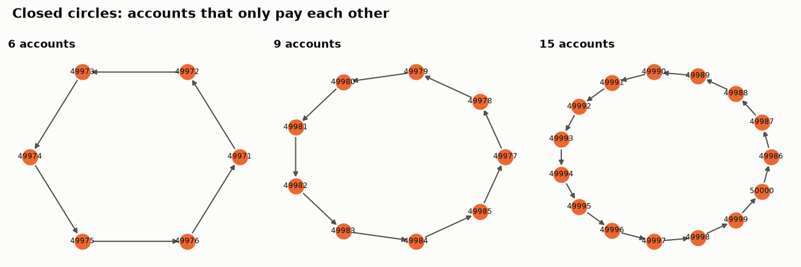

**Who is central?** `gpagerank` with `top=12`, joined to the names. 25 ms.

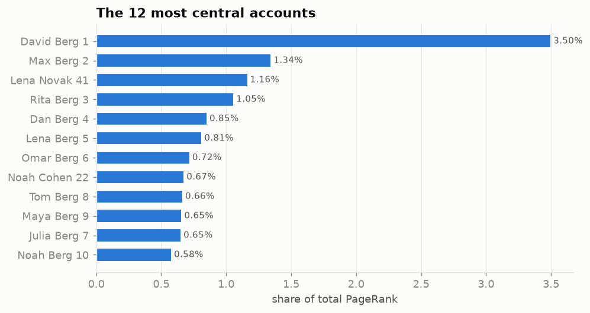

**Which accounts look unusual?** This is where a graph inside an analytic
database pays off. The graph functions' output is a table. It is stored next to
the payment features and handed to Vertica's in-database machine learning, an
isolation forest through VerticaPy, without moving a row out of the database.
The planted circles stand out at once.

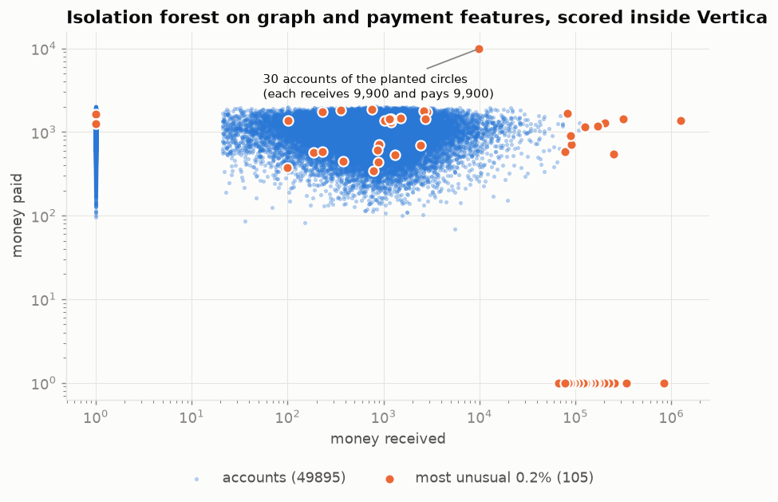

**A transfer arrives.** The flagged account pays a member of one of the circles.
The same query, a moment later, without any refresh, follows the money into the
circle; and the circle is no longer an island. An external graph database would
show this after its next import.

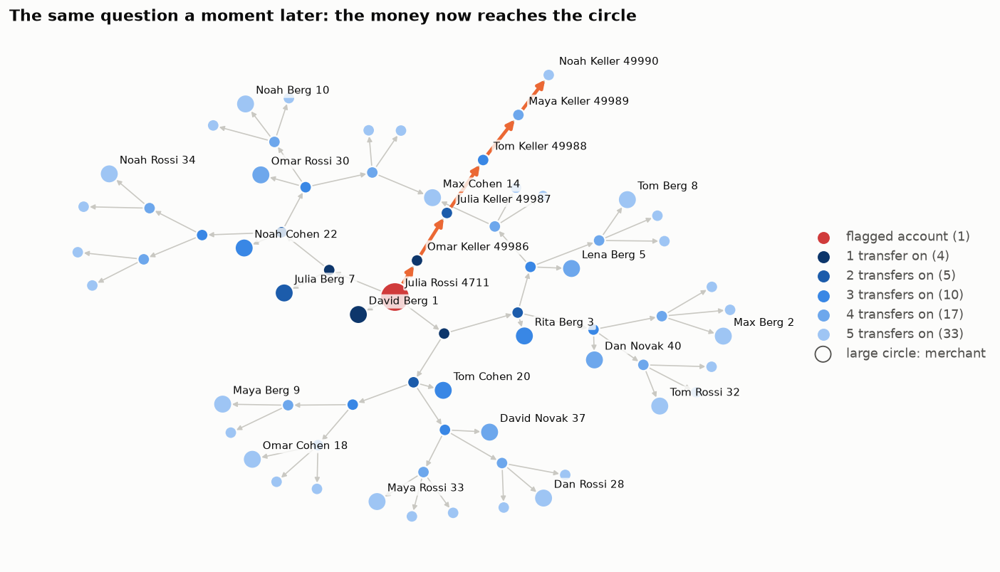

## 6. What it is, and what it is not

It is graph analytics where the data already lives: no second system, no copy
pipeline, exact results on live data, results as SQL rows, one security model,
in-database machine learning on top, and the scale, backup and high availability
of a columnar MPP database underneath. In the measurements above it surpasses
Neo4j's capabilities for graph analytics: deep traversals, whole-graph
algorithms, storage, and everything that happens to the result afterwards.

It is not a Cypher engine, and it does not offer the property-graph model:
properties are columns in your own tables, reached by a join. (The first
repository shows how a Cypher subset can be translated to SQL.) A query runs on
the node that started it and is not spread over the cluster. One graph holds up
to about 4.29 billion nodes, and node ids are integers. Very small questions
cost what a SQL statement costs, 2 to 4 ms.

## 7. Should you move your graph work into Vertica?

We expected to write "close enough, and much simpler to operate". We did not
expect to write "38 times faster". So here is the plain version.

**Move it, or never build the second system, when** your graph questions are
analytics: neighbourhoods, reach, paths, communities, centrality, features for
machine learning; when the edges already live in the warehouse, or belong there;
when the answer has to be joined with business data; when the data changes and
the answer must reflect it now; when the graph is large. On this evidence you
give up nothing in speed, and you lose a copy pipeline, a second security model
and a second cluster.

**Stay with a graph database when** your application is written in Cypher and
uses rich pattern matching across many node and relationship types; when you
depend on the property-graph model or on the vendor's visual tools; when the
workload is many tiny transactional graph updates rather than analytics.

**In between**, do what we did: take your own data, run both on the same machine,
and compare the answers before you compare the times. The script is in the
repository.

## 8. Try it

You need Vertica 26.x with its C++ SDK, g++ with C++17, and make, on one
database node. It builds on x86_64 and ARM.

    git clone https://github.com/mogomo/vertica-graph-udx
    git clone https://github.com/mogomo/vertica-graphs-and-trees
    cd vertica-graph-udx
    make && make test && make deploy          # make deploy FENCED=no for the fastest mode
    scripts/demo.sh                           # small end-to-end demo, cleans up
    scripts/benchmark.sh --rows=100000000     # the measurements, on your machine
    scripts/neo4j_compare.sh --neo4j_home=... # the comparison, on your machine

Then, on your own edge table:

    CALL vgraph.register_graph('contacts', 'app.contacts', 'src', 'dst', 'del', NULL, TRUE, 'ts', NULL);
    CALL vgraph.refresh_graph('contacts');
    CALL vgraph.schedule_refresh('contacts', '0 * * * *');

The README covers the journal layout, the freshness rules, the limits and all
parameters. `docs/design.md` explains the reasoning, `docs/format.md` the
snapshot format.
