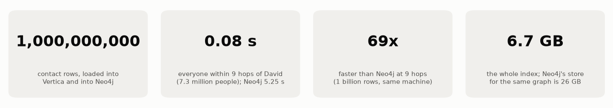
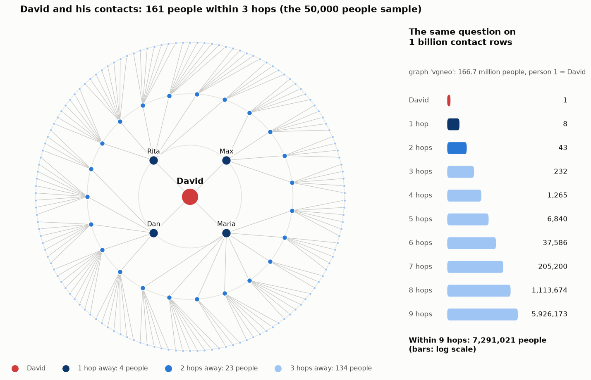
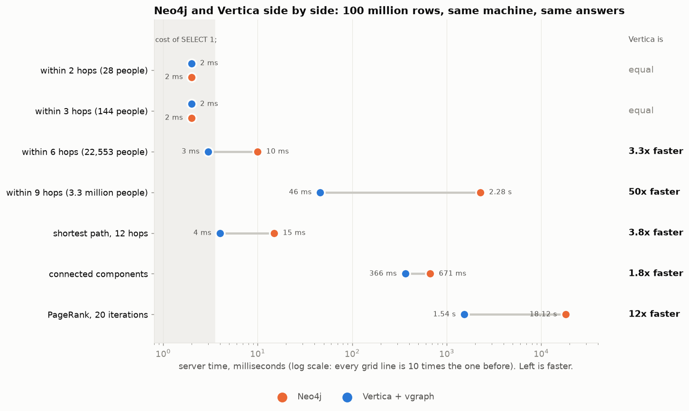
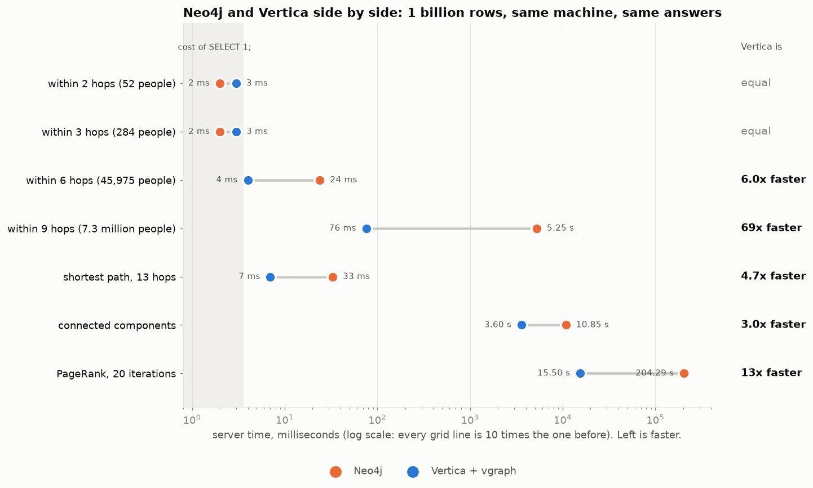
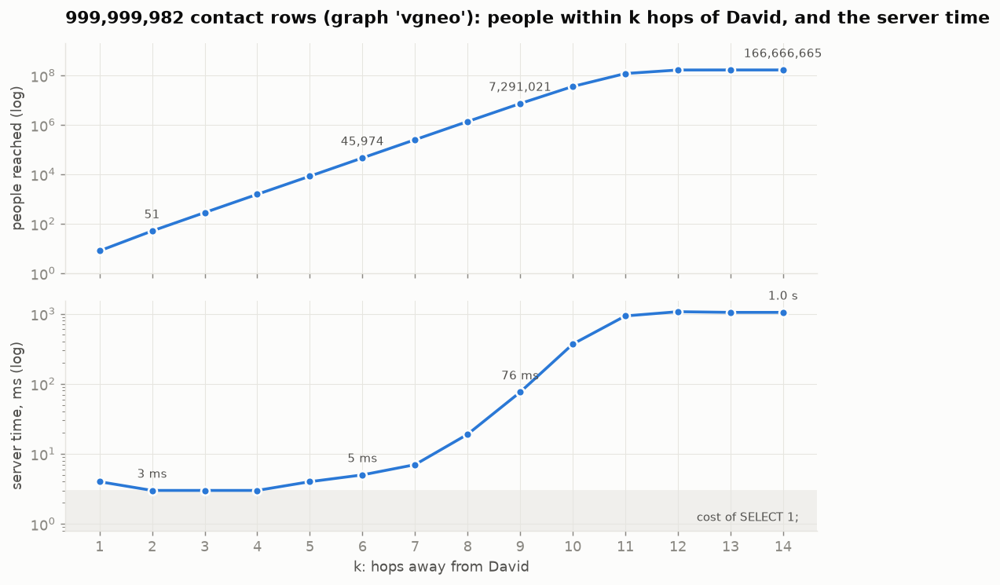

# A graph engine inside Vertica: side by side with Neo4j, at one billion rows

*Code: https://github.com/mogomo/vertica-graph-udx (MIT). Earlier work: https://github.com/mogomo/vertica-graphs-and-trees.*

## Abstract

`vgraph` is an open-source C++ extension (a UDx) that adds graph functions to
the Vertica analytic database: neighbourhoods within k hops, shortest paths,
connected components and PageRank. The edges stay in an ordinary table, and
every function is called from SQL like a built-in function.

I ran the same questions, on the same data, on the same machine, in Vertica and
in Neo4j: first at 100 million rows, then at **one billion**. Both systems
returned the same answers everywhere they could answer.

At a billion rows Vertica finds everyone within 9 hops of David, 7.3 million
people, in **0.08 seconds**, against Neo4j's 5.25 seconds: **69 times faster**.
It is **13 times** faster at PageRank, **5 times** at the shortest path and
**3 times** at connected components,
before counting the 169-second in-memory projection Neo4j has to build before it
can run either, and it uses **less than half the disk**. The smallest questions
cost what a SQL statement costs in both systems.

The result that surprised me most is not a ratio. Neo4j's store for the
billion-row graph is **26 GB** on a 34 GB machine, and no single Neo4j
configuration could answer every question: the traversals need a large page
cache, the whole-graph algorithms need a large heap, and the two do not fit
together. Vertica's index for the same graph is **6.7 GB**, so one configuration
answers everything.

This article has seven parts:

1. Background: a graph database, a relational analytic database, and a UDx.
2. The story: one customer question, two repositories, one surprise.
3. The test environment.
4. The sample data: David and his contacts.
5. The files involved in the tests.
6. The results: 100 million rows side by side with Neo4j, then one billion rows.
7. The bottom line.

## 1. Background

### A graph, and a graph database like Neo4j

A graph is a set of things (**nodes**) and the connections between them
(**edges**): people and their contacts, accounts and transfers, parts and
assemblies. Most graph questions are **traversals**: start at one node and
follow the edges, level by level. "Friends of friends" is a traversal of two
levels.

A graph database such as Neo4j is built for that. Every node record points
directly at its edges, so following an edge is following a pointer. Questions
are written in Cypher, a language made of patterns:

    MATCH (a:Person {id: 1})-[:KNOWS*1..3]-(b) RETURN count(DISTINCT b)

The design has a price. The graph lives in a second system, as a copy of data
that usually comes from somewhere else. Whole-graph algorithms such as PageRank
first need a projection of the graph into memory, again after every restart.
And every report that combines the graph with business data crosses a system
boundary.

### A relational analytic database like Vertica

Vertica is a columnar, massively parallel SQL database. Each column is stored
separately, sorted and compressed, and tables are spread over the nodes of a
cluster. It scans, joins and aggregates billions of rows, scales out by adding
nodes, and runs machine learning in the database. A contact table fits well:
two integer columns that compress to a few bytes per row.

In plain SQL a traversal is one self-join per level. It works, but every level
is a join against the whole table, so deep questions take seconds.

### A UDx, and why it matters

Vertica can be extended with a **UDx**, a user-defined extension: a function
written in C++ against the Vertica SDK and compiled into a library.

- **After it is compiled and installed, it is part of the Vertica engine.**
  `CREATE LIBRARY` and `CREATE FUNCTION`, once. From then on anybody can call
  it from SQL like any other built-in function: in a query, a view, a join, a
  BI tool.
- **Vertica does the heavy lifting around it**: the query plan, security,
  resource management and, in fenced mode, isolation in a separate process.
- **It is simple to write and maintain.** A UDx is one class that reads rows
  and writes rows, and one factory that declares the argument and return types.
  In this repository every SQL function is one small file in `src/udx`. The
  graph algorithms are plain C++ without any Vertica code, tested on a laptop.

A query looks like this, and the result is rows that SQL can join, filter and
aggregate:

    SELECT vgraph.gkhop(start, target, src, dst, del, weight, ver, snapshot_id
                        USING PARAMETERS graph='contacts', start=1, depth=9) OVER()
    FROM app.contacts_delta;

## 2. The story: one customer question, two repositories, one surprise

A customer asked me a simple question: *"Can Vertica give me level 9 of David's
contacts, the way Neo4j does?"*

**The first repository**,
[vertica-graphs-and-trees](https://github.com/mogomo/vertica-graphs-and-trees),
was my answer in plain SQL: a stored procedure that runs one `INSERT ... SELECT`
per level. It answers level 9 on 100 million rows in a few seconds. It worked.
But it ended with an honest sentence: for algorithms such as PageRank, "a graph
engine remains the right tool".

That sentence was the trigger for **the second repository**,
[vertica-graph-udx](https://github.com/mogomo/vertica-graph-udx): the graph
engine itself, written as a UDx, inside Vertica. It keeps a compact index of the
contact table inside the database, and every query combines that index with the
rows written after it, so answers are exact on live data.

Then I installed Neo4j on the same machine, loaded the same data and asked the
same questions. I expected to write "close enough, and simpler to operate".
**The surprise: Vertica with the UDx was faster at almost everything** — and at
a billion rows it was the only one of the two that could answer every question
without being re-tuned first.

## 3. The test environment

| | |
|---|---|
| Machine | one virtual machine on a Mac laptop: ARM (aarch64), 8 cores, 35 GB RAM, Rocky Linux 9 |
| Vertica | 26.2, one node; `vgraph` installed unfenced, 8 threads (one per core) |
| Neo4j | 5.26 Community with APOC and Graph Data Science 2.13.4, JDK 21; loaded with `neo4j-admin database import` |
| Data | the same generated contact rows in both systems (section 4), at 100 million and at 1 billion rows |
| Memory | at 100 million rows: 8 GB heap and 8 GB page cache, and Neo4j's whole 2.8 GB store fits in it. At a billion rows the store is 26 GB and cannot fit, so Neo4j was given whatever setting each question needs; section 6 explains this |
| Times | server times on both sides, best of several runs after a warm-up. Vertica: `v_monitor.query_requests`. Neo4j: the times `cypher-shell` reports |
| Answers | compared for every question: **identical** |

The same code also passes all its tests on a 3-node Vertica Eon cluster on
x86_64 (RHEL 8). That system proves portability; the performance numbers come
from the machine above.

One number to remember: on this machine **`SELECT 1;` takes up to 2 ms** in
Vertica. A statement that does nothing costs that much. Any time at that level
measures the cost of a statement, not of a graph search.

## 4. The sample data: David and his contacts

The data generator of the first repository builds a LinkedIn-style contact
table:

- `contact(src_id, dst_id)`: one row means "src knows dst". Person 1 is David.
- Every person picks 3 random contacts, and each contact is stored in both
  directions. That gives 6 rows per person: **100 million rows are 16.7 million
  people; one billion rows are 166.7 million people.**
- The question: **who is within k hops of David?** 1 hop is the people David
  knows, 2 hops is the people they know, and so on. Every person is counted
  once, at the smallest number of hops. (The customer counts David as level 1,
  so level = hops + 1.)

The picture shows David's graph. On the left, the first three hops, drawn from
a small sample of the same data. On the right, the same question on the one
billion row table: the number of people grows about five times per hop.

## 5. The files involved in the tests

| File | What it does | How to use it |
|---|---|---|
| `graph_contacts_demo.sql` (first repository) | generates the contact table; holds the SQL procedure `bfs`, the correctness reference | clone the first repository next to the second; the scripts call it |
| `Makefile` | builds the library, runs the unit tests, installs the functions | `make && make test && make deploy` (`FENCED=no` for the fastest mode) |
| `src/engine/` | the graph engine in plain C++17: index, search, path, components, PageRank | compiled by `make` |
| `src/udx/` | one small Vertica adapter per SQL function | compiled by `make` |
| `sql/install.sql`, `sql/procedures.sql` | schema `vgraph`, the functions, the procedures `register_graph`, `refresh_graph` and others | run by `make deploy` |
| `scripts/benchmark.sh` | the Vertica measurements: load, index build, k-hop against the SQL procedure, fenced and unfenced | `scripts/benchmark.sh --rows=100000000` |
| `scripts/neo4j_compare.sh` | the side-by-side test: same data and same questions in Vertica and Neo4j; fails if the answers differ | `scripts/neo4j_compare.sh --neo4j_home=DIR --rows=100000000` |
| `scripts/demo.sh` | a small end-to-end demo that cleans up after itself | `scripts/demo.sh` |
| `notebook/vgraph_demo.ipynb` | this article as a notebook, with live runs | Jupyter |

The repository's README explains every file and option.

## 6. The results

### 100 million rows: Neo4j and Vertica side by side

100 million contact rows, 16.7 million people, on the machine of section 3.
Both systems returned the same answer for every question.

| Question (100 million rows) | Neo4j | Vertica + vgraph | Vertica is |
|---|---:|---:|---|
| people within 2 hops of David (28) | 1 to 2 ms | 2 ms | equal * |
| people within 3 hops (144) | 1 to 3 ms | 2 ms | equal * |
| people within 6 hops (22,553) | 10 ms | **3 ms** | **3 times faster** |
| people within 9 hops (3.3 million) | 2.28 s | **0.046 s** | **50 times faster** |
| shortest path, 12 hops | 15 ms | **4 ms** | **3.8 times faster** |
| connected components | 0.67 s, after a 5.8 s projection | **0.37 s** | **1.8 times faster** |
| PageRank, 20 iterations | 18.1 s, after the same projection | **1.54 s** | **12 times faster** |
| load the data | 45 s (export, import, index) | 17 s | |
| prepare for graph queries | 5.8 s projection, after every restart | 19 s index build (`refresh_graph`) | |
| size on disk | 2.8 GB | **1.1 GB** (table 444 MB, index 667 MB) | **2.5 times smaller** |

\* At or below the cost of `SELECT 1;` (up to 2 ms on this machine). These times
measure the cost of a statement, not of a graph search. They are not relevant
for the comparison and are shown for completeness.

Neo4j: the better of a Cypher pattern and APOC for the k-hop questions (6 hops:
Cypher 10 ms, APOC 13 ms; 9 hops: APOC 2.28 s, Cypher 2.35 s); Graph Data Science for components
and PageRank (the community edition uses at most 4 threads). At 6 hops Vertica's 3 ms is itself the cost of a
statement, so read "3 times" as "at least".

Where the question is large enough to measure the engine, Vertica is faster: 3
times at 6 hops, 50 times at 9 hops, 3.8 times for the shortest path, 12 times
for PageRank and 1.8 times for connected components, and it needs 2.5 times
less disk space.

This table was measured again on 2026-09-21, on newly generated data loaded into
both systems. The generator is random: in this graph person 1 reaches 3.3
million people within 9 hops, in the run I published first 5.8 million. The
reason for the new run is in the next section.

It did not start that way. In the first run Neo4j found the
shortest path 100 times faster, because `vgraph` searched from one end only. A
search from both ends that meets in the middle fixed it. A competitor on the
same machine is the best profiler there is.

### One billion rows

The same generator with 1,000,000,000 rows: 166.7 million people, on the same
machine, and this time **Neo4j was loaded with the same billion rows too**. The
generator picks random contacts on every run, so this is a different graph from
the one above: here person 1 reaches 7,291,022 people within 9 hops.

**How both systems were measured.** Neo4j's store for this graph is 26 GB on a
machine with 34 GB, so the two cannot both be resident at once. Each system was
therefore measured **alone on the machine, with a warm cache**: one run to warm
it, then the best of the runs that followed.

| Question (1 billion rows, 166.7 million people) | Neo4j | Vertica + vgraph | Vertica is |
|---|---:|---:|---|
| people within 2 hops of David (52) | 2 ms | 3 ms | equal * |
| people within 3 hops (284) | 2 ms | 3 ms | equal * |
| people within 6 hops (45,975) | 24 ms | **4 ms** | **6 times faster** |
| people within 9 hops (7,291,022) | 5.25 s | **0.076 s** | **69 times faster** |
| shortest path, 13 hops | 33 ms | **7 ms** | **4.7 times faster** |
| connected components (1) | 10.9 s, after a 169.5 s projection | **3.60 s** | **3 times** (50 with the projection) |
| PageRank, 20 iterations | 204.3 s, after the same projection | **15.5 s** | **13 times** (24 with the projection) |
| get the data in | 9.7 min (export 1.9 + import 6.3 + index 1.4) | **2.2 min** (generated in place) | 4.3 times |
| prepare for graph queries | **169.5 s** projection, again after every restart | 10.2 min `refresh_graph`, once per refresh | Neo4j 3.6 times |
| size on disk | 26.4 GB | **11.6 GB** (table 4.9 + index 6.7) | **2.3 times smaller** |

\* At or below the cost of `SELECT 1;`: not relevant for the comparison.

**I published this table twice, and the first version is worth knowing.** It had
31 ms at 6 hops, 0.19 s at 9 hops and 116 ms for the shortest path, and Neo4j
won the path row by 3.5 times. I first blamed my path function, the only one
that ran on a single core, and put it on all cores. That gained 4 ms. So I
measured the search alone, outside Vertica: 8 ms. The other 50 ms were page
faults. Every statement mapped the 6.7 GB index file anew, and a new mapping
pays a fault for every page a search touches, 34,000 of them for that one path.
The library now keeps the mapping between statements, and every search gained:
6 hops went from 31 ms to 4 ms, 9 hops from 0.19 s to 0.076 s, the path from
116 ms to 7 ms. Neo4j's numbers are the ones measured before; nothing changed
on its side. For the second time in this project, the competitor on the same
machine found the problem. The cost of the fix is stated in `docs/design.md`:
unfenced, the mapping lives in the Vertica process; fenced, the first graph
query of every session still pays the faults.

**The memory finding.** This is the part I did not expect, and it is worth more
than any single row of the table. No one Neo4j configuration on this machine
could answer all the questions:

- The k-hop questions need a large **page cache**. With 10 GB of page cache,
  9 hops took **242.9 seconds**. With 22 GB, the same question on the same data
  took **5.25 seconds**: 46 times faster, with nothing else changed.
- The whole-graph algorithms need a large **heap**. With a 14 GB heap,
  `gds.graph.project` stopped with `java.lang.OutOfMemoryError`. It needed a
  **26 GB heap**, and then spent 169.5 seconds building its in-memory copy of
  the graph before any algorithm could start.
- A 22 GB page cache and a 26 GB heap do not both fit in 34 GB.

So at this size, on this machine, you have to decide in advance which kind of
graph question Neo4j should be good at. Vertica needed no such decision: its
index for the same graph is 6.7 GB, the operating system keeps it in memory, and
one configuration answers every question. That is what a compact index buys, and
it is the practical difference between the two designs at scale.

**What the billion-row test says.** Vertica is far ahead on the deep question,
ahead at 6 hops and on the shortest path, on both whole-graph algorithms, on
disk and on loading. Neo4j is ahead in preparing for the whole-graph algorithms
(a 170 s projection against a 10 minute index build), and the smallest questions
are the cost of a statement on both sides. Ten times more data than the previous section
did not change the shape of the answer: query time follows the size of the
answer, not the size of the table. On a billion rows, reaching 3.7 million
people took 0.045 s and reaching 7.3 million took 0.076 s.

The index is a 6.67 GB file that queries map into memory. The build itself holds
8 MB while Vertica sorts the billion rows, and the machine did not swap.

## 7. The bottom line

One question started this: *"Can Vertica give me level 9 of David's contacts,
the way Neo4j does?"* Yes. On one billion rows, in 0.08 seconds, against
Neo4j's 5.25 seconds on the same data and the same machine.

**Where Vertica wins.** Deep traversals: 50 times at 100 million rows, 69 times
at a billion. The shortest path: 3.8 and 4.7 times. The whole-graph algorithms: 3 times for connected components and
13 times for PageRank, and that is before counting the projection Neo4j has to
build first, which at a billion rows takes 169 seconds and has to be built again
after every restart. Disk: 2.5 times less at 100 million rows, less than half at a
billion. Loading the data.

**Where Neo4j wins.** Preparing for the whole-graph algorithms: its projection
takes 170 s at a billion rows and the Vertica index build 10 minutes (the
projection is built again after every restart, the index is not). The smallest
questions cost what a SQL statement costs in both systems, where a millisecond
is not a difference between engines. And the first version of this article had
Neo4j 3.5 times ahead at the shortest path on a billion rows: that was my
mistake in how the index file was opened, not Neo4j's doing, and it is told
above.

**The thing I would tell a colleague first** is none of those numbers. It is
that at a billion rows Neo4j's 26 GB store did not fit the machine, and no one
configuration could answer every kind of question: the traversals wanted the
memory as page cache, the algorithms wanted it as heap, and there was not enough
for both. Vertica's index for the same graph is 6.7 GB. One configuration, every
question, and the operating system does the caching. Compactness turned out to
matter more than any single ratio.

And there is no second system: the contacts stay in a Vertica table, the result
of a graph function is SQL rows that join with everything else in the warehouse,
answers are exact on live data, and once the UDx is installed anybody can call
it like a built-in function.

The limits, plainly. This is graph *analytics*. It is not a Cypher engine and
not a property-graph store. The results are for one data shape, on one machine,
against Neo4j Community. For graph analytics on warehouse data, Vertica with
this extension surpasses Neo4j's capabilities in these measurements. Do not take
my word for it: `scripts/neo4j_compare.sh` repeats the whole comparison on your
hardware. Compare the answers first and the times second.

    git clone https://github.com/mogomo/vertica-graph-udx
    git clone https://github.com/mogomo/vertica-graphs-and-trees
    cd vertica-graph-udx
    make && make test && make deploy
    scripts/neo4j_compare.sh --neo4j_home=DIR --rows=100000000

For the billion-row run, give Neo4j the memory it needs for the question you
care about:

    scripts/neo4j_compare.sh --neo4j_home=DIR --rows=1000000000 --heap=6g --pagecache=22g
